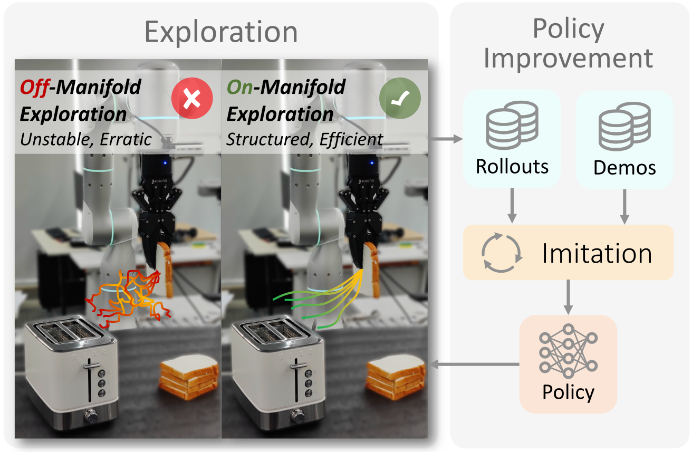

#  SOE: Sample-Efficient Robot Policy Self-Improvement via On-Manifold Exploration

[[Project page]](https://ericjin2002.github.io/SOE/)
[[Paper]](https://arxiv.org/abs/2509.19292)
[[Code]](https://github.com/EricJin2002/SOE)



## 🛠️ Installation

1. Create a conda environment and install PyTorch with CUDA support. We recommend using Python 3.8 for better compatibility with the dependencies.
```bash
conda create -n soe python=3.8
conda activate soe
conda install pytorch torchvision pytorch-cuda=12.1 -c pytorch -c nvidia
```

2. Install the required packages.
```bash
pip install -r requirements.txt
```

3. Install [Pytorch3D](https://github.com/facebookresearch/pytorch3d) from source.
```bash
mkdir dependencies && cd dependencies
git clone git@github.com:facebookresearch/pytorch3d.git
cd pytorch3d
pip install -e .
cd ../..
```

4. Follow the official [guide](https://robomimic.github.io/docs/introduction/installation.html) to install [robomimic](https://github.com/ARISE-Initiative/robomimic). To reproduce the results, please consider installing the package from source and checkout to this [commit](https://github.com/ARISE-Initiative/robomimic/commit/9273f9cce85809b4f49cb02c6b4d4eeb2fe95abb).
```bash
cd dependencies
git clone https://github.com/ARISE-Initiative/robomimic.git
cd robomimic
git checkout 9273f9cce85809b4f49cb02c6b4d4eeb2fe95abb
pip install -e .
cd ../..
```

## 🖥️ Reproducing Simulation Benchmark Results

### Dataset Preparation

We use the [robomimic](https://github.com/ARISE-Initiative/robomimic) benchmark for simulation experiments. Please follow the [instructions](https://robomimic.github.io/docs/datasets/robomimic_v0.1.html) to download the low-dim datasets.
```bash
cd simulation && python download_datasets.py --tasks sim --dataset_types ph --hdf5_types low_dim --download_dir datasets
```

The image datasets can be converted from the low-dim datasets.
```bash
cd simulation && bash extract_obs_from_raw_datasets.sh
```
### Running the Pipeline

We provide a unified script, `run_full_multi_round.py`, to execute the complete *SOE* pipeline. It automates the entire workflow: from data extraction, action conversion (to absolute coordinates), and config generation, to multi-round training, evaluation, exploration, and refinement.

To run *SOE* using *DP* as the baseline, use the command below. The `--config` argument specifies the configuration name, which corresponds to a file located in `simulation/config_template/`. For a complete list of arguments, please refer to `simulation/run_full_multi_round.py`.

```bash
cd simulation
python run_full_multi_round.py --dataset datasets/can/ph/image_v141.hdf5 --output_dir out/can_soe_multi_round/ --used_demo core_20 --config can_soe --seeds 233 2333 23333 233333 --cuda_device 0 1 2 3 --noise_scale 2.0
python run_full_multi_round.py --dataset datasets/lift/ph/image_v141.hdf5 --output_dir out/lift_soe_multi_round/ --used_demo core_10 --config lift_soe --seeds 233 2333 23333 233333 --cuda_device 0 1 2 3 --noise_scale 2.0
python run_full_multi_round.py --dataset datasets/square/ph/image_v141.hdf5 --output_dir out/square_soe_multi_round/ --used_demo core_20 --config square_soe --seeds 233 2333 23333 233333 --cuda_device 0 1 2 3 --noise_scale 2.0
python run_full_multi_round.py --dataset datasets/transport/ph/image_v141.hdf5 --output_dir out/transport_soe_multi_round/ --used_demo core_20 --config transport_soe --seeds 233 2333 23333 233333 --cuda_device 0 1 2 3 --noise_scale 2.0
```

Alternatively, use the following command to run the *SIME* baseline:

```bash
cd simulation
python run_full_multi_round.py --dataset datasets/can/ph/image_v141.hdf5 --output_dir out/can_sime_multi_round/ --used_demo core_20 --config can_sime --seeds 233 2333 23333 233333 --cuda_device 0 1 2 3
python run_full_multi_round.py --dataset datasets/lift/ph/image_v141.hdf5 --output_dir out/lift_sime_multi_round/ --used_demo core_10 --config lift_sime --seeds 233 2333 23333 233333 --cuda_device 0 1 2 3
python run_full_multi_round.py --dataset datasets/square/ph/image_v141.hdf5 --output_dir out/square_sime_multi_round/ --used_demo core_20 --config square_sime --seeds 233 2333 23333 233333 --cuda_device 0 1 2 3
python run_full_multi_round.py --dataset datasets/transport/ph/image_v141.hdf5 --output_dir out/transport_sime_multi_round/ --used_demo core_20 --config transport_sime --seeds 233 2333 23333 233333 --cuda_device 0 1 2 3
```


## 🤖 Running on a Real Robot

For real-world experiments, we employ a Flexiv Rizon 4 robot arm equipped with a Robotiq 2F-85 gripper. The gripper fingers have been replaced with custom TPU soft fingers. We utilize two Intel RealSense D435i depth cameras for perception: one mounted on the robot wrist (eye-in-hand) and the other positioned to provide a side view (third-person). A Force Dimension Sigma.7 haptic interface is used to teleoperate the robot and collect demonstrations.

Before running the real-world experiments, ensure that the following dependencies are installed:

- [Flexiv RDK](https://github.com/flexivrobotics/flexiv_rdk)
- [Sigma SDK](https://www.forcedimension.com/software/sdk)
- [RealSense SDK](https://pypi.org/project/pyrealsense2/)
- [pynput](https://pypi.org/project/pynput/) (for keyboard monitoring)

### Expert Demonstration Collection

Modify the `camera_serial` and `path_prefix` (to save the demonstrations) in the `realworld/teleoperate.py` script and run it to collect the expert demonstrations.

```bash
cd realworld && python teleoperate.py
```

### Policy Training

To train the policy, you need to provide a configuration file. Examples can be found in `realworld/config/`. After setting up the config, please refer to the `realworld/command_train.sh` script to train the policy.

### Policy Evaluation

To evaluate the policy, run the command below. For a full list of arguments, please refer to `realworld/eval.py`. By default, the script saves evaluation data (images and actions) to the specified `--record_path`.

```bash
python eval.py --config /path/to/logs/task/timestamp/config.json --ckpt /path/to/logs/task/timestamp/ckpt/policy_last.ckpt --num_action 20 --num_inference_step 20 --max_steps 1000 --seed 233 --discretize_rotation --ensemble_mode act --vis --record --record_path /path/to/record/path
```

### Exploration and Data Collection

To enable online exploration, add the `--enable_exploration` flag. We provide two exploration modes:
- *SOE (Default)*: This is the default mode. We recommend setting `--noise_scale` between 1.0 and 2.0 for optimal performance.
- *SIME*: To use *SIME*-style exploration instead, add the `--sime` flag.

During exploration, you can use keyboard inputs for human-in-the-loop steering. Key bindings are defined (and can be modified) in `realworld/eval.py`. Additionally, the script `src/calc_snr.py` is available to calculate the Signal-to-Noise Ratio (SNR) of latent dimensions, which aids in the steering process.

After data collection, use `realworld/clean_data.py` and `realworld/clean_failure.py` to filter the results. Episodes with successful task completions and transitions with non-stop actions are then utilized for the next round of policy training.

### Policy Improvement

The policy improvement step is the same as training. The only difference is that the training data for improvement includes both the original expert demonstrations and the successful exploration data collected in the previous step. Please refer to the policy tranining section for details. The cycle of exploration and improvement can be repeated for multiple rounds, leading to continuous policy enhancement.

## 🙏 Acknowledgement

Our code is built upon [SIME](https://github.com/EricJin2002/SIME), [Diffusion Policy](https://github.com/real-stanford/diffusion_policy), [RISE](https://github.com/rise-policy/rise), [robomimic](https://github.com/ARISE-Initiative/robomimic), [S2I](https://github.com/Junxix/S2I), and [VQ-BeT](https://github.com/jayLEE0301/vq_bet_official). We thank the authors for their open-sourcing efforts, which greatly facilitate our research.

## 🔗 Citation

If you find this code useful, please consider citing our paper.

```bibtex
@article{jin2025soe,
  title={SOE: Sample-Efficient Robot Policy Self-Improvement via On-Manifold Exploration},
  author={Jin, Yang and Lv, Jun and Xue, Han and Chen, Wendi and Wen, Chuan and Lu, Cewu},
  journal={arXiv preprint arXiv:2509.19292},
  year={2025}
}

@inproceedings{jin2025sime,
  title={Sime: Enhancing policy self-improvement with modal-level exploration},
  author={Jin, Yang and Lv, Jun and Yu, Wenye and Fang, Hongjie and Li, Yong-Lu and Lu, Cewu},
  booktitle={2025 IEEE/RSJ International Conference on Intelligent Robots and Systems (IROS)},
  pages={9792--9799},
  year={2025},
  organization={IEEE}
}
```